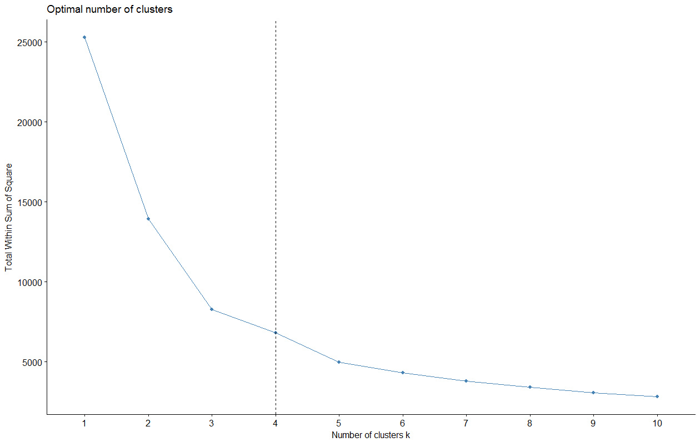
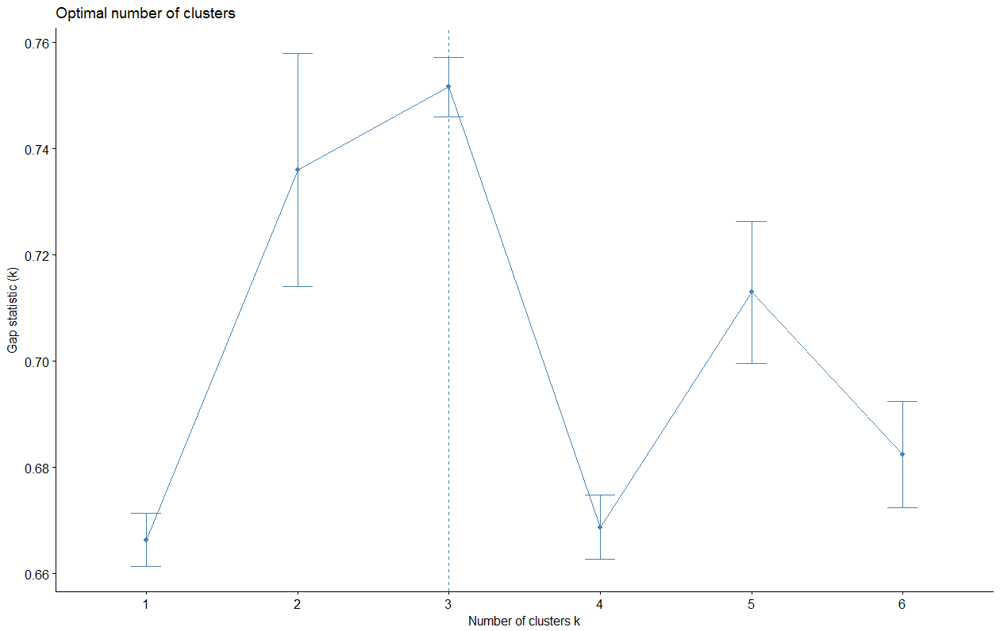
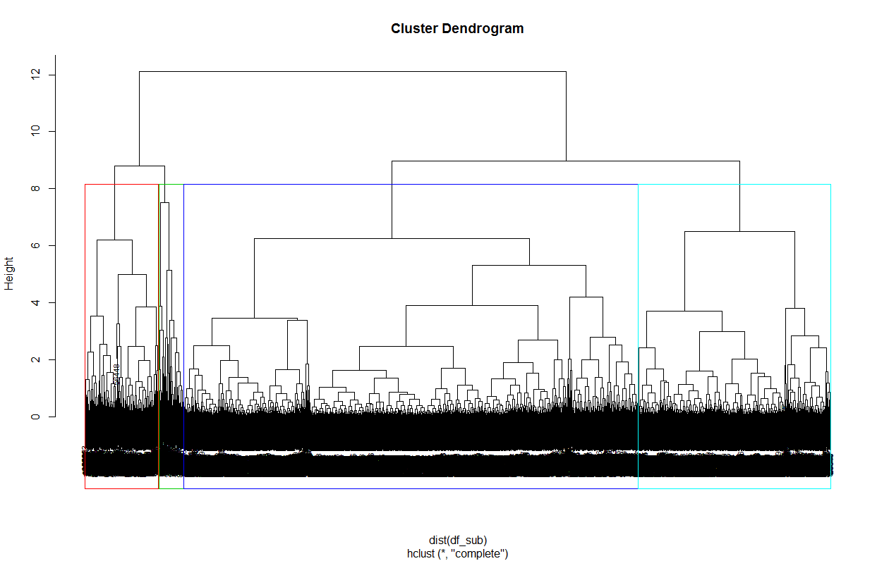
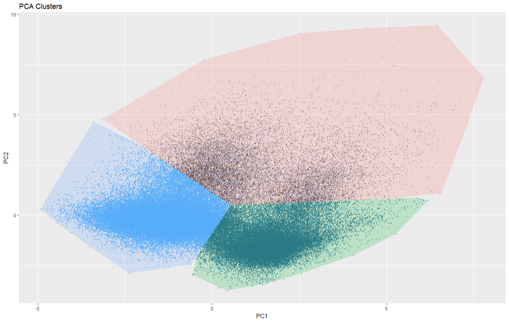
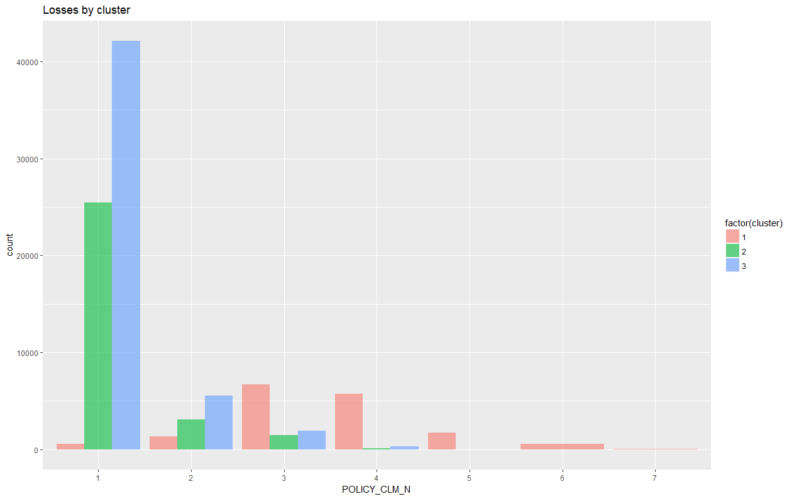

```{r, message=FALSE, warning=FALSE, echo=TRUE, collapse=TRUE, results='hide'}
library(tidyverse)
library(caret)
library(caretEnsemble)
library(xgboost)
library(readr)
library(MicrosoftML)
library(lubridate)

dat <- list(
  #col_double(), col_character()
  raw = read_delim(
    "data.txt", 
    delim = ";", 
    col_types = list(
      col_factor(levels = NULL), # DATA_TYPE
      col_integer(), # POLICY_ID
      col_integer(),  # POLICY_BEGIN_MONTH
      col_integer(),  # POLICY_END_MONTH
      #col_factor(levels = c(0,1)), # POLICY_IS_RENEWED
      col_number(), # POLICY_IS_RENEWED
      col_integer(),  # POLICY_SALES_CHANNEL
      col_integer(),  # POLICY_SALES_CHANNEL_GROUP
      col_character(), # POLICY_BRANCH -- NEED PREPROC
      col_integer(),# POLICY_MIN_AGE
      col_integer(), #POLICY_MIN_DRIVING_EXPERIENCE need preprocess
      col_character(), # VEHICLE_MAKE
      col_character(), # VEHICLE_MODEL
      col_integer(), # VEHICLE_ENGINE_POWER
      col_integer(), #VEHICLE_IN_CREDIT
      col_integer(), # VEHICLE_SUM_INSURED
      col_character(), #POLICY_INTERMEDIARY Maybe not needed
      col_character(), # INSURER_GENDER -- NEED PREPROC
      col_character(), # POLICY_CLM_N     -- NEED PREPROC
      col_character(), # POLICY_CLM_GLT_N -- NEED PREPROC
      col_character(), # POLICY_PRV_CLM_N -- NEED PREPROC
      col_character(), # POLICY_PRV_CLM_GLT_N -- NEED PREPROC
      col_integer(), # CLIENT_HAS_DAGO
      col_integer(), # CLIENT_HAS_OSAGO
      col_integer(), # POLICY_COURT_SIGN
      col_double(), #CLAIM_AVG_ACC_ST_PRD
      col_integer(), # POLICY_HAS_COMPLAINTS
      col_integer(), # POLICY_YEARS_RENEWED_N
      col_integer(), # POLICY_DEDUCT_VALUE
      col_character(), # CLIENT_REGISTRATION_REGION -- NEED PREPROC
      col_double() # POLICY_PRICE_CHANGE
    )
  ),
  raw_clusters = NA
)

#dat$raw <- dat$raw %>% 
#  dplyr::select( -DATA_TYPE, -POLICY_IS_RENEWED)

# factor to numeric
dat$raw$CLIENT_REGISTRATION_REGION <- as.numeric(as.factor(dat$raw$CLIENT_REGISTRATION_REGION))
dat$raw$VEHICLE_MAKE <- as.numeric(as.factor(dat$raw$VEHICLE_MAKE))
dat$raw$VEHICLE_MODEL <- as.numeric(as.factor(dat$raw$VEHICLE_MODEL))
dat$raw$POLICY_INTERMEDIARY <- as.numeric(as.factor(dat$raw$POLICY_INTERMEDIARY))
dat$raw$POLICY_CLM_N <- as.numeric(as.factor(dat$raw$POLICY_CLM_N))
dat$raw$POLICY_CLM_GLT_N <- as.numeric(as.factor(dat$raw$POLICY_CLM_GLT_N))
dat$raw$POLICY_PRV_CLM_N <- as.numeric(as.factor(dat$raw$POLICY_PRV_CLM_N))
dat$raw$POLICY_BRANCH <- as.numeric(as.factor(dat$raw$POLICY_BRANCH))
dat$raw$INSURER_GENDER <- as.numeric(as.factor(dat$raw$INSURER_GENDER))
dat$raw$POLICY_PRV_CLM_GLT_N <- as.numeric(as.factor(dat$raw$POLICY_PRV_CLM_GLT_N))

# Clear POLICY_MIN_DRIVING_EXPERIENCE
dat$raw$POLICY_MIN_DRIVING_EXPERIENCE <- ifelse(
  dat$raw$POLICY_MIN_DRIVING_EXPERIENCE > 1000, 
  year(Sys.Date()) - dat$raw$POLICY_MIN_DRIVING_EXPERIENCE, dat$raw$POLICY_MIN_DRIVING_EXPERIENCE
)

dat$raw <- dat$raw %>% dplyr::select(-POLICY_ID, -POLICY_IS_RENEWED)

# Missing value impute 
imputDate <- c("VEHICLE_ENGINE_POWER","POLICY_YEARS_RENEWED_N", 
               "VEHICLE_SUM_INSURED", "POLICY_DEDUCT_VALUE")


pr_model_median <- preProcess(dat$raw[,imputDate], method = "medianImpute" )
dat$raw[,imputDate] <- predict(pr_model_median, dat$raw[,imputDate])

pr_model_pca <- preProcess(dat$raw, method = c("center","scale","pca"), pcaComp = 2)
full_df <- predict(pr_model_pca, dat$raw %>% select(-DATA_TYPE))
```

### Поиск оптимального колличества кластеров. Метод локтя

```{r, message=FALSE, warning=FALSE, echo=TRUE, collapse=TRUE, results='hide'}
df_sub <- full_df[sample(nrow(full_df), nrow(full_df) / 20),]

k.max <- 15 # максимальное число кластеров
wss <- sapply(1:k.max, function(k)
{kmeans(df_sub, k, nstart = 10 )$tot.withinss})
plot(1:k.max, wss, type = "b", pch = 19, frame = FALSE,
     xlab = "Число кластеров K",
     ylab = "Общая внутригрупповая сумма квадратов")
# Формируем график с помощью fviz_nbclust()
library(factoextra)
fviz_nbclust(df_sub, kmeans, method = "wss") +
geom_vline(xintercept = 4, linetype = 2)
```



### Поиск оптимального колличества кластеров метод GAP-статистики

```{r, message=FALSE, warning=FALSE, echo=TRUE, collapse=TRUE, results='hide'}
library(cluster)
set.seed(123)
gap_stat <- clusGap(df_sub, FUN = kmeans, K.max = 6, B = 5)
# Печать и визуализация результатов
print(gap_stat, method = "firstmax")
fviz_gap_stat(gap_stat)
```



### Иерархическая кластеризация

```{r, message=FALSE, warning=FALSE, echo=TRUE, collapse=TRUE, results='hide'}
res.hc <- hclust(dist(df_sub), method = "complete" )
grp <- cutree(res.hc, k = 4) # Разрезание дерева на 4 группы
plot(res.hc, cex = 0.7)
rect.hclust(res.hc, k = 4, border = 2:5)
```



В результате, по предыдущим методам можно сделать вывод что в данных 3-4 кластера, 2 из 3 анализа показывают что три кластера наиболее релевантное значение, изобразим эти кластеры на плоскости

### Построение кластеров

```{r, message=FALSE, warning=FALSE, echo=TRUE, collapse=TRUE, results='hide'}
set.seed(100)
clus <- kmeans(full_df,centers = 3)
full_df$cluster <- clus$cluster
library('ggplot2'); library('grDevices')
h <- do.call(rbind, lapply(unique(clus$cluster),
function(c) { f <- subset(full_df,cluster == c); f[chull(f),]}))
ggplot() + geom_text(data = full_df, aes(label = cluster, x = PC1, y = PC2,
 color = cluster), size = 1) +
 geom_polygon(data = h, aes(x = PC1, y = PC2, group = cluster,
 fill = as.factor(cluster)), alpha = 0.2, linetype = 0) +
 theme(legend.position = "none") + ggtitle("PCA Clusters")
```




```{r, message=FALSE, warning=FALSE, echo=TRUE, collapse=TRUE, results='hide'}
dat$raw_clusters <- cbind(dat$raw, clus$cluster)
names(dat$raw_clusters)[ncol(dat$raw_clusters)] <- "cluster"
clusters <- dat$raw_clusters$cluster
```

## Выводы:

```{r, message=FALSE, warning=FALSE, echo=TRUE, collapse=TRUE, results='hide'}
dat$raw_clusters %>% 
  ggplot(aes(x = factor(POLICY_CLM_N), fill = factor(cluster))) +  
  geom_bar(astat = "identity",position = "dodge", alpha = 0.6) + 
  xlab("POLICY_CLM_N") +
  ggtitle("Losses by cluster")

```



Как видно из графика страхователь из кластера 1 убыточен для компании, попробуем прогнозировать убытки от полиса для страхователя из кластера 1

## Прогнозирование убытков страхователя на основе информации о кластеризации и той информации которая у нас есть до заключения договора

* Отберем признаки которые нам известны еще до заключения договора, на них и будем обучать алгоритм
* Посмотрим точность классификации убытков без признака кластера на тестовой выборке
* Посмотрим точность классификации убытков с признаком кластера на тестовой выборке

```{r, message=FALSE, warning=FALSE, echo=TRUE, collapse=TRUE, results='hide'}
tmp <- dat$raw_clusters %>% select(DATA_TYPE, POLICY_CLM_N, POLICY_BEGIN_MONTH, POLICY_BRANCH, 
                            POLICY_SALES_CHANNEL, POLICY_SALES_CHANNEL_GROUP,
                            POLICY_MIN_AGE, POLICY_MIN_DRIVING_EXPERIENCE, VEHICLE_MAKE, 
                            VEHICLE_MODEL, VEHICLE_ENGINE_POWER, VEHICLE_IN_CREDIT,
                            VEHICLE_SUM_INSURED, INSURER_GENDER, 
                            CLIENT_HAS_DAGO, CLIENT_HAS_OSAGO, CLIENT_REGISTRATION_REGION, 
                            POLICY_YEARS_RENEWED_N, cluster)

rxtrain <- rxImport(inData = as.data.frame(tmp %>% filter(DATA_TYPE == "TRAIN")), outFile = "rxtrain.xdf", overwrite = TRUE)
rxtest <- rxImport(inData = as.data.frame(tmp %>% filter(DATA_TYPE != "TRAIN")), outFile = "rxtest.xdf", overwrite = TRUE)

fmla <- paste0( names(rxtrain)[which(names(rxtrain) == "POLICY_CLM_N")], " ~ ", 
                paste( names(rxtrain)[-which(names(rxtrain) %in% c("POLICY_CLM_N","cluster"))], collapse = ' + ' ))

fmla_cluster <- paste0( names(rxtrain)[which(names(rxtrain) == "POLICY_CLM_N")], " ~ ", 
                paste( names(rxtrain)[-which(names(rxtrain) %in% c("POLICY_CLM_N"))], collapse = ' + ' ))

multiNN <- rxNeuralNet(
  formula = fmla,
  data = rxtrain,
  type = "multiClass", 
  numHiddenNodes = 100,
  reportProgress = 0,
  normalize = "yes"
)

multiNN_Cluster <- rxNeuralNet(
  formula = fmla_cluster,
  data = rxtrain,
  type = "multiClass", 
  numHiddenNodes = 100,
  reportProgress = 0,
  normalize = "yes"
)

scoreMultiDF <- rxPredict(multiNN, data = rxtest, extraVarsToWrite = "POLICY_CLM_N", outData = NULL)    
 # Print the first rows of the data frame with scores
 #head(scoreMultiDF)
 # Compute % of incorrect predictions
badPrediction = scoreMultiDF$POLICY_CLM_N != scoreMultiDF$PredictedLabel
sum(badPrediction)*100/nrow(scoreMultiDF)
 # Look at the observations with incorrect predictions
 #scoreMultiDF[badPrediction,]

scoreMultiDF_Cluster <- rxPredict(multiNN_Cluster, data = rxtest, extraVarsToWrite = "POLICY_CLM_N", outData = NULL)    
badPrediction = scoreMultiDF_Cluster$POLICY_CLM_N != scoreMultiDF_Cluster$PredictedLabel
sum(badPrediction)*100/nrow(scoreMultiDF_Cluster)
 
```

### Ошибка предсказания убытков для алгоритма без признака кластера  *29%*
### Ошибка предсказания убытков для алгоритма без признака кластера  *23%*

Таким образом нам удалось улучшить прогноз убытков на 5% используя сегментацию страхователей

## Резюме: 

Самый доходный страхователь это мужчина 42 года, проживающий в Санкт-Петербурге, получивший полис в Санкт-петербурге, с оценочной стоимостью авто до 700 т.р, который уже 2 года продливал полис

```{r, message=FALSE, warning=FALSE, echo=TRUE, collapse=TRUE, results='hide'}
dat <- list(
  #col_double(), col_character()
  raw = read_delim(
    "data.txt", 
    delim = ";", 
    col_types = list(
      col_factor(levels = NULL), # DATA_TYPE
      col_integer(), # POLICY_ID
      col_factor(levels = NULL), # POLICY_BEGIN_MONTH
      col_factor(levels = NULL), # POLICY_END_MONTH
      col_factor(levels = c(0,1)), # POLICY_IS_RENEWED
      #col_number(), # POLICY_IS_RENEWED
      col_factor(levels = NULL), # POLICY_SALES_CHANNEL
      col_factor(levels = NULL), # POLICY_SALES_CHANNEL_GROUP
      col_factor(levels = NULL), # POLICY_BRANCH
      col_integer(),# POLICY_MIN_AGE
      col_integer(), #POLICY_MIN_DRIVING_EXPERIENCE need preprocess
      col_factor(levels = NULL), # VEHICLE_MAKE
      col_factor(levels = NULL), # VEHICLE_MODEL
      col_number(), # VEHICLE_ENGINE_POWER
      col_factor(levels = NULL), #VEHICLE_IN_CREDIT
      col_integer(), # VEHICLE_SUM_INSURED
      col_character(), #POLICY_INTERMEDIARY Maybe not needed
      col_factor(levels = NULL), # INSURER_GENDER
      col_factor(levels = NULL), # POLICY_CLM_N
      col_factor(levels = NULL), # POLICY_CLM_GLT_N
      col_factor(levels = NULL), # POLICY_PRV_CLM_N
      col_factor(levels = NULL), # POLICY_PRV_CLM_GLT_N
      col_factor(levels = NULL), # CLIENT_HAS_DAGO
      col_factor(levels = NULL), # CLIENT_HAS_OSAGO
      col_integer(), # POLICY_COURT_SIGN
      col_double(), #CLAIM_AVG_ACC_ST_PRD
      col_integer(), # POLICY_HAS_COMPLAINTS
      col_integer(), # POLICY_YEARS_RENEWED_N
      col_integer(), # POLICY_DEDUCT_VALUE
      col_factor(levels = NULL), # CLIENT_REGISTRATION_REGION
      col_double() # POLICY_PRICE_CHANGE
    )
  ),
  dat_test = NA
)

# Clear POLICY_MIN_DRIVING_EXPERIENCE
dat$raw$POLICY_MIN_DRIVING_EXPERIENCE <- ifelse(
  dat$raw$POLICY_MIN_DRIVING_EXPERIENCE > 1000, 
  year(Sys.Date()) - dat$raw$POLICY_MIN_DRIVING_EXPERIENCE, dat$raw$POLICY_MIN_DRIVING_EXPERIENCE
)

dat$raw <- dat$raw %>% dplyr::select(-POLICY_ID, -POLICY_IS_RENEWED, -DATA_TYPE)

# Missing value impute 
imputDate <- c("VEHICLE_ENGINE_POWER","POLICY_YEARS_RENEWED_N", 
               "VEHICLE_SUM_INSURED", "POLICY_DEDUCT_VALUE")

pr_model_median <- preProcess(dat$raw[,imputDate], method = "medianImpute" )
dat$raw[,imputDate] <- predict(pr_model_median, dat$raw[,imputDate])

dat$dat_test <- cbind(dat$raw, clusters)

dat$dat_test <- dat$dat_test %>% filter(clusters %in% c(3))
```

## Идентификация страхователя по выбранному кластеру

```{r, message=FALSE, warning=FALSE, echo=TRUE, collapse=TRUE}
options(scipen = 999)

region_rank = function(x) {
  tr <- prop.table(table(x))
  tr <- tr[order(tr, decreasing = T)]
  tr <- data.frame(names(tr), as.numeric(tr), stringsAsFactors = F)
  names(tr) <- c("Region", "Coef")
  head(tr, 4)
}

worst <- list(
  INSURER_GENDER = dat$dat_test %>% summarise(
   Female = sum(INSURER_GENDER == "F") / nrow(.), 
   Male = sum(INSURER_GENDER == "M") / nrow(.)),
  
  POLICY_MIN_AGE = median(dat$dat_test$POLICY_MIN_AGE),
  
  POLICY_BRANCH = dat$dat_test %>% summarise(
    Moscow = sum(POLICY_BRANCH == "Москва") / nrow(.), 
    St = sum(POLICY_BRANCH == "Санкт-Петербург") / nrow(.)),
  
  POLICY_MIN_DRIVING_EXPERIENCE =  median(dat$dat_test$POLICY_MIN_DRIVING_EXPERIENCE),
  
  VEHICLE_IN_CREDIT = dat$dat_test %>% summarise(
    NoCredit = sum(VEHICLE_IN_CREDIT == 0) / nrow(.), 
    Credit = sum(VEHICLE_IN_CREDIT == 1) / nrow(.)),
  
  VEHICLE_ENGINE_POWER = median(dat$dat_test$VEHICLE_ENGINE_POWER),
  
  VEHICLE_SUM_INSURED =  median(dat$dat_test$VEHICLE_SUM_INSURED),
  
  POLICY_HAS_COMPLAINTS = dat$dat_test %>% mutate( POLICY_HAS_COMPLAINTS_FAC = ifelse(POLICY_HAS_COMPLAINTS == 0, 0, 1 )) %>% 
    summarise(
    zero = sum(POLICY_HAS_COMPLAINTS_FAC == 0) / nrow(.), 
    more_one = sum(POLICY_HAS_COMPLAINTS_FAC == 1) / nrow(.)),
  
  POLICY_YEARS_RENEWED_N = median(dat$dat_test$POLICY_YEARS_RENEWED_N),
  
  CLIENT_REGISTRATION_REGION = region_rank(dat$dat_test$CLIENT_REGISTRATION_REGION)
)
print(worst)
```
