```{r, message=FALSE, warning=FALSE, echo=TRUE, collapse=TRUE, results='hide'}
library(tidyverse)
library(caret)
library(caretEnsemble)
library(xgboost)
library(readr)
library(MicrosoftML)
library(lubridate)

dat <- list(
  #col_double(), col_character()
  raw = read_delim(
    "data.txt", 
    delim = ";", 
    col_types = list(
      col_factor(levels = NULL), # DATA_TYPE
      col_integer(), # POLICY_ID
      col_integer(),  # POLICY_BEGIN_MONTH
      col_integer(),  # POLICY_END_MONTH
      #col_factor(levels = c(0,1)), # POLICY_IS_RENEWED
      col_number(), # POLICY_IS_RENEWED
      col_integer(),  # POLICY_SALES_CHANNEL
      col_integer(),  # POLICY_SALES_CHANNEL_GROUP
      col_character(), # POLICY_BRANCH -- NEED PREPROC
      col_integer(),# POLICY_MIN_AGE
      col_integer(), #POLICY_MIN_DRIVING_EXPERIENCE need preprocess
      col_character(), # VEHICLE_MAKE
      col_character(), # VEHICLE_MODEL
      col_integer(), # VEHICLE_ENGINE_POWER
      col_integer(), #VEHICLE_IN_CREDIT
      col_integer(), # VEHICLE_SUM_INSURED
      col_character(), #POLICY_INTERMEDIARY Maybe not needed
      col_character(), # INSURER_GENDER -- NEED PREPROC
      col_character(), # POLICY_CLM_N     -- NEED PREPROC
      col_character(), # POLICY_CLM_GLT_N -- NEED PREPROC
      col_character(), # POLICY_PRV_CLM_N -- NEED PREPROC
      col_character(), # POLICY_PRV_CLM_GLT_N -- NEED PREPROC
      col_integer(), # CLIENT_HAS_DAGO
      col_integer(), # CLIENT_HAS_OSAGO
      col_integer(), # POLICY_COURT_SIGN
      col_double(), #CLAIM_AVG_ACC_ST_PRD
      col_integer(), # POLICY_HAS_COMPLAINTS
      col_integer(), # POLICY_YEARS_RENEWED_N
      col_integer(), # POLICY_DEDUCT_VALUE
      col_character(), # CLIENT_REGISTRATION_REGION -- NEED PREPROC
      col_double() # POLICY_PRICE_CHANGE
    )
  ),
  raw_clusters = NA
)

#dat$raw <- dat$raw %>% 
#  dplyr::select( -DATA_TYPE, -POLICY_IS_RENEWED)

# factor to numeric
dat$raw$CLIENT_REGISTRATION_REGION <- as.numeric(as.factor(dat$raw$CLIENT_REGISTRATION_REGION))
dat$raw$VEHICLE_MAKE <- as.numeric(as.factor(dat$raw$VEHICLE_MAKE))
dat$raw$VEHICLE_MODEL <- as.numeric(as.factor(dat$raw$VEHICLE_MODEL))
dat$raw$POLICY_INTERMEDIARY <- as.numeric(as.factor(dat$raw$POLICY_INTERMEDIARY))
dat$raw$POLICY_CLM_N <- as.numeric(as.factor(dat$raw$POLICY_CLM_N))
dat$raw$POLICY_CLM_GLT_N <- as.numeric(as.factor(dat$raw$POLICY_CLM_GLT_N))
dat$raw$POLICY_PRV_CLM_N <- as.numeric(as.factor(dat$raw$POLICY_PRV_CLM_N))
dat$raw$POLICY_BRANCH <- as.numeric(as.factor(dat$raw$POLICY_BRANCH))
dat$raw$INSURER_GENDER <- as.numeric(as.factor(dat$raw$INSURER_GENDER))
dat$raw$POLICY_PRV_CLM_GLT_N <- as.numeric(as.factor(dat$raw$POLICY_PRV_CLM_GLT_N))

# Clear POLICY_MIN_DRIVING_EXPERIENCE
dat$raw$POLICY_MIN_DRIVING_EXPERIENCE <- ifelse(
  dat$raw$POLICY_MIN_DRIVING_EXPERIENCE > 1000, 
  year(Sys.Date()) - dat$raw$POLICY_MIN_DRIVING_EXPERIENCE, dat$raw$POLICY_MIN_DRIVING_EXPERIENCE
)

dat$raw <- dat$raw %>% dplyr::select(-POLICY_ID, -POLICY_IS_RENEWED, -DATA_TYPE)

# Missing value impute 
imputDate <- c("VEHICLE_ENGINE_POWER","POLICY_YEARS_RENEWED_N", 
               "VEHICLE_SUM_INSURED", "POLICY_DEDUCT_VALUE")

pr_model_median <- preProcess(dat$raw[,imputDate], method = "medianImpute" )
dat$raw[,imputDate] <- predict(pr_model_median, dat$raw[,imputDate])

pr_model_pca <- preProcess(dat$raw, method = c("center","scale","pca"), pcaComp = 2)
full_df <- predict(pr_model_pca, dat$raw)
```

### Поиск оптимального колличества кластеров. Метод локтя

```{r, message=FALSE, warning=FALSE, echo=TRUE, collapse=TRUE, results='hide'}
df_sub <- full_df[sample(nrow(full_df), nrow(full_df) / 30),]

k.max <- 15 # максимальное число кластеров
wss <- sapply(1:k.max, function(k)
{kmeans(df_sub, k, nstart = 10 )$tot.withinss})
plot(1:k.max, wss, type = "b", pch = 19, frame = FALSE,
     xlab = "Число кластеров K",
     ylab = "Общая внутригрупповая сумма квадратов")
# Формируем график с помощью fviz_nbclust()
library(factoextra)
fviz_nbclust(df_sub, kmeans, method = "wss") +
geom_vline(xintercept = 4, linetype = 2)
```

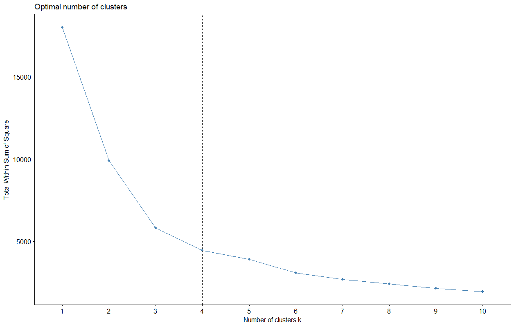

### Поиск оптимального колличества кластеров метод GAP-статистики

```{r, message=FALSE, warning=FALSE, echo=TRUE, collapse=TRUE, results='hide'}
library(cluster)
set.seed(123)
gap_stat <- clusGap(df_sub, FUN = kmeans, K.max = 6, B = 5)
# Печать и визуализация результатов
print(gap_stat, method = "firstmax")
fviz_gap_stat(gap_stat)
```

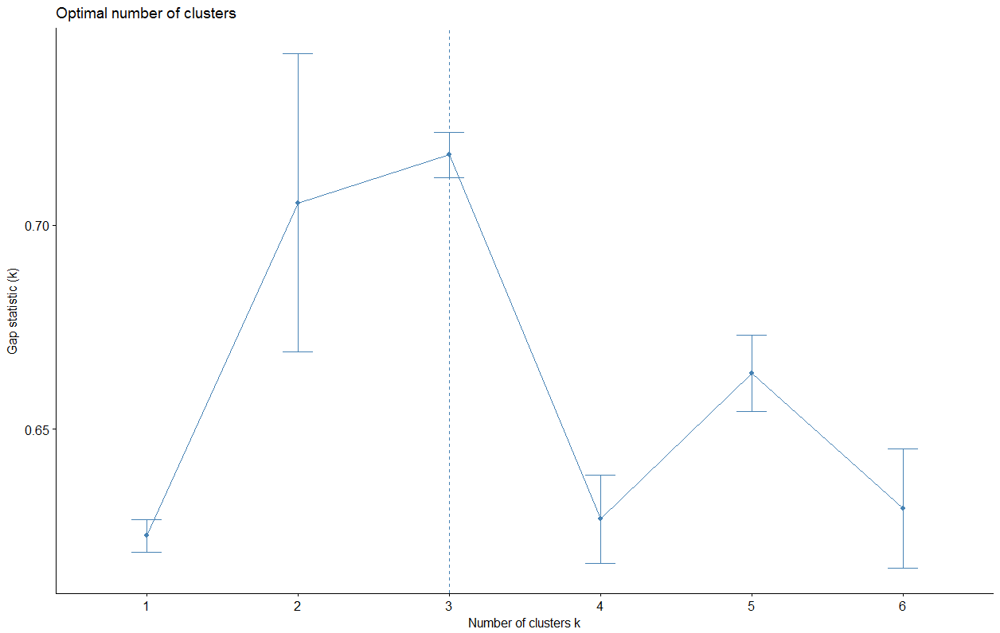

### Иерархическая кластеризация

```{r, message=FALSE, warning=FALSE, echo=TRUE, collapse=TRUE, results='hide'}
res.hc <- hclust(dist(df_sub), method = "complete" )
grp <- cutree(res.hc, k = 4) # Разрезание дерева на 4 группы
plot(res.hc, cex = 0.7)
rect.hclust(res.hc, k = 4, border = 2:5)
```

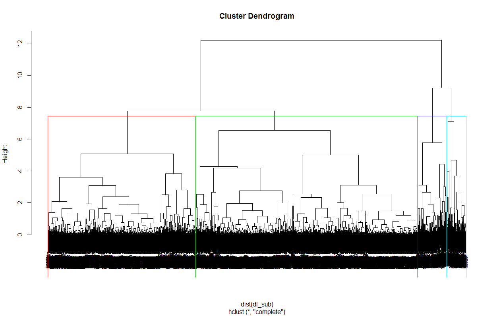

В результате, по предыдущим методам можно сделать вывод что в данных 3-4 кластера, 2 из 3 анализа показывают что три кластера наиболее релевантное значение, изобразим эти кластеры на плоскости

### Построение кластеров

```{r, message=FALSE, warning=FALSE, echo=TRUE, collapse=TRUE, results='hide'}
set.seed(100)
clus <- kmeans(full_df,centers = 3)
full_df$cluster <- clus$cluster
library('ggplot2'); library('grDevices')
h <- do.call(rbind, lapply(unique(clus$cluster),
function(c) { f <- subset(full_df,cluster == c); f[chull(f),]}))
ggplot() + geom_text(data = full_df, aes(label = cluster, x = PC1, y = PC2,
 color = cluster), size = 1) +
 geom_polygon(data = h, aes(x = PC1, y = PC2, group = cluster,
 fill = as.factor(cluster)), alpha = 0.2, linetype = 0) +
 theme(legend.position = "none") + ggtitle("PCA Clusters")
```

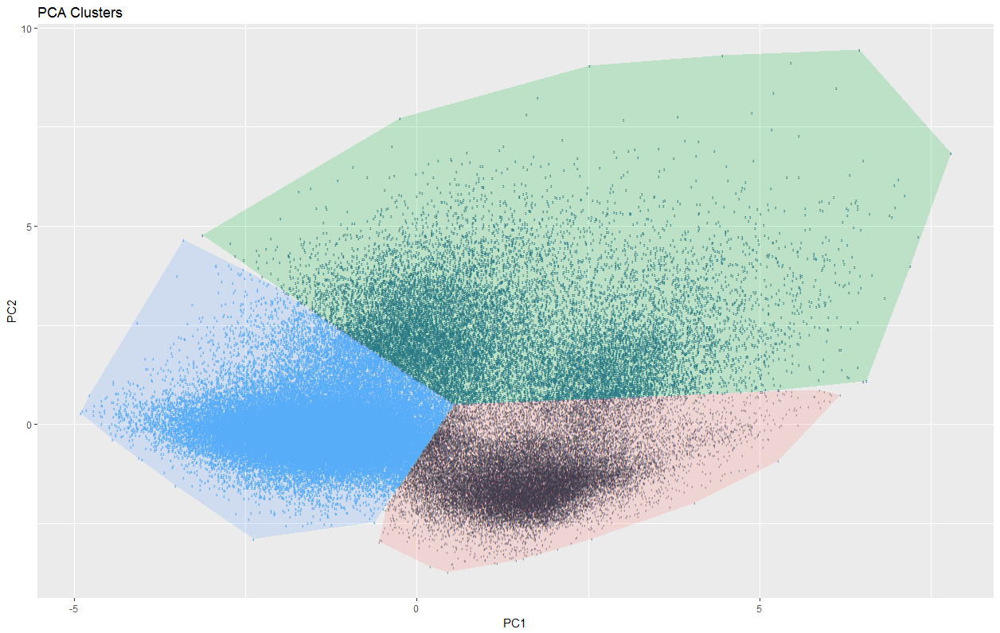

## Построение выводов 

```{r}
dat$raw_clusters <- cbind(dat$raw, clus$cluster)
names(dat$raw_clusters)[ncol(dat$raw_clusters)] <- "cluster"

dat$raw_clusters <- dat$raw_clusters %>% 
  dplyr::select(VEHICLE_SUM_INSURED, POLICY_DEDUCT_VALUE, POLICY_PRICE_CHANGE, CLAIM_AVG_ACC_ST_PRD, cluster)

featurePlot(dat$raw_clusters[, -which(names(dat$raw_clusters) == 'cluster')], dat$raw_clusters$cluster)

clusters <- dat$raw_clusters$cluster
```

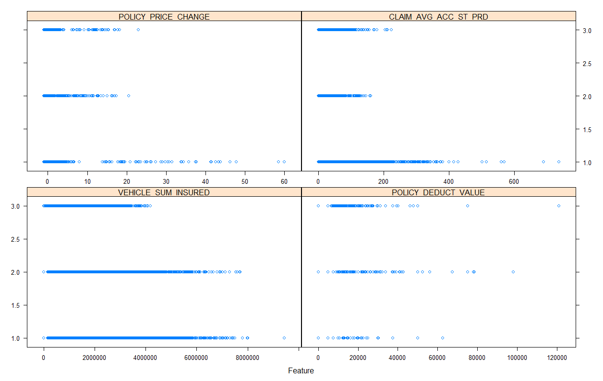

## Выводы:
* POLICY_PRICE_CHANGE : Для кластера 1 страховая премия которую страхователь обязан выплатит стаховщику выше чем для других кластеров. Предпочителен для страхования
* CLAIM_AVG_ACC_ST_PRD : Среднее время от страхового случая до заявления убытков по данному полису в кластере 1 выше чем в других кластеров, Предпочителен для страхования (инфляция и депозит сделает свое дело)
* VEHICLE_SUM_INSURED : Страховая сумма по полису для 1 кластера имеет имеет самое высокое медианное значение. Снизить риски, увеличить стоимость полиса
* POLICY_DEDUCT_VALUE : Медианная сумма франшизы самая низкая для 1 кластера. Предпочителен для страхования.

Резюме: Страхователь из первого кластера наиболее предпочителен для страхования. Посмотрим на характиристики этого страхователя

```{r}
dat <- list(
  #col_double(), col_character()
  raw = read_delim(
    "data.txt", 
    delim = ";", 
    col_types = list(
      col_factor(levels = NULL), # DATA_TYPE
      col_integer(), # POLICY_ID
      col_factor(levels = NULL), # POLICY_BEGIN_MONTH
      col_factor(levels = NULL), # POLICY_END_MONTH
      col_factor(levels = c(0,1)), # POLICY_IS_RENEWED
      #col_number(), # POLICY_IS_RENEWED
      col_factor(levels = NULL), # POLICY_SALES_CHANNEL
      col_factor(levels = NULL), # POLICY_SALES_CHANNEL_GROUP
      col_factor(levels = NULL), # POLICY_BRANCH
      col_integer(),# POLICY_MIN_AGE
      col_integer(), #POLICY_MIN_DRIVING_EXPERIENCE need preprocess
      col_factor(levels = NULL), # VEHICLE_MAKE
      col_factor(levels = NULL), # VEHICLE_MODEL
      col_number(), # VEHICLE_ENGINE_POWER
      col_factor(levels = NULL), #VEHICLE_IN_CREDIT
      col_integer(), # VEHICLE_SUM_INSURED
      col_character(), #POLICY_INTERMEDIARY Maybe not needed
      col_factor(levels = NULL), # INSURER_GENDER
      col_factor(levels = NULL), # POLICY_CLM_N
      col_factor(levels = NULL), # POLICY_CLM_GLT_N
      col_factor(levels = NULL), # POLICY_PRV_CLM_N
      col_factor(levels = NULL), # POLICY_PRV_CLM_GLT_N
      col_factor(levels = NULL), # CLIENT_HAS_DAGO
      col_factor(levels = NULL), # CLIENT_HAS_OSAGO
      col_factor(levels = NULL), # POLICY_COURT_SIGN
      col_double(), #CLAIM_AVG_ACC_ST_PRD
      col_factor(levels = NULL), # POLICY_HAS_COMPLAINTS
      col_integer(), # POLICY_YEARS_RENEWED_N
      col_integer(), # POLICY_DEDUCT_VALUE
      col_factor(levels = NULL), # CLIENT_REGISTRATION_REGION
      col_double() # POLICY_PRICE_CHANGE
    )
  ),
  dat_test = NA
)

# Clear POLICY_MIN_DRIVING_EXPERIENCE
dat$raw$POLICY_MIN_DRIVING_EXPERIENCE <- ifelse(
  dat$raw$POLICY_MIN_DRIVING_EXPERIENCE > 1000, 
  year(Sys.Date()) - dat$raw$POLICY_MIN_DRIVING_EXPERIENCE, dat$raw$POLICY_MIN_DRIVING_EXPERIENCE
)

dat$raw <- dat$raw %>% dplyr::select(-POLICY_ID, -POLICY_IS_RENEWED, -DATA_TYPE)

# Missing value impute 
imputDate <- c("VEHICLE_ENGINE_POWER","POLICY_YEARS_RENEWED_N", 
               "VEHICLE_SUM_INSURED", "POLICY_DEDUCT_VALUE")

pr_model_median <- preProcess(dat$raw[,imputDate], method = "medianImpute" )
dat$raw[,imputDate] <- predict(pr_model_median, dat$raw[,imputDate])

dat$dat_test <- cbind(dat$raw, clusters)

dat$dat_test <- dat$dat_test %>% filter(clusters == 1)
```

## Идентификация идеального клиента

```{r}
options(scipen = 999)
  qplot(dat$dat_test$POLICY_MIN_AGE, main = "Средний возраст ~ 35-40 лет",xlab = "age", bins = 30)
  qplot(dat$dat_test$POLICY_SALES_CHANNEL, main = "Канал продаж 50,52, 53, 54, 55")
  qplot(dat$dat_test$POLICY_SALES_CHANNEL_GROUP, main = "Группа канал продаж 6")
  qplot(dat$dat_test$POLICY_BRANCH, main = "Город Москва")
  qplot(dat$dat_test$POLICY_MIN_DRIVING_EXPERIENCE, main = "Минимальный стаж вождения ~ 10 лет")
  qplot(dat$dat_test$VEHICLE_ENGINE_POWER, bins = 80, xlim = c(50,300), main = "Автомобиль ~ 150 h/p")
  qplot(dat$dat_test$VEHICLE_IN_CREDIT, main = "Автомобиль не в кредите")
  qplot(dat$dat_test$VEHICLE_SUM_INSURED, xlim = c(100000, 2500000), bins = 30, main = "Оценочная стоимость ТС - лимит возмещения ~ 1 млн" )
  qplot(dat$dat_test$INSURER_GENDER, main = "Водитель мужчина")
  qplot(dat$dat_test$CLIENT_HAS_DAGO, main = "Клиент без полиса ДАГО")
  qplot(dat$dat_test$POLICY_COURT_SIGN, main = "Кол-во убытков, всего по предыдущему полису отсуствуют")
  qplot(dat$dat_test$POLICY_HAS_COMPLAINTS, main = "По полису не было жалоб")
  qplot(dat$dat_test$POLICY_YEARS_RENEWED_N, main = "Новый клиент предпочтительнее")
```

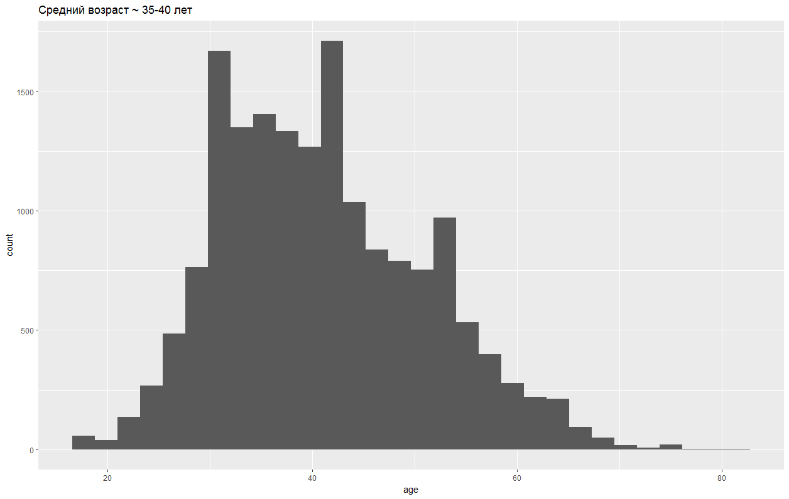
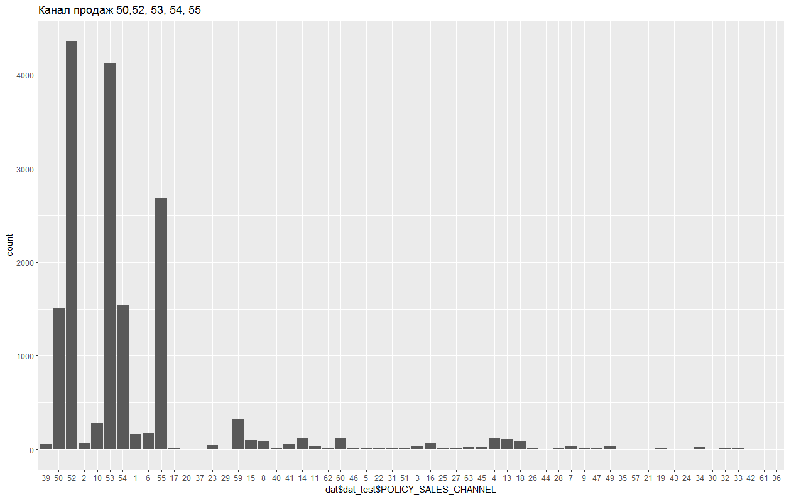
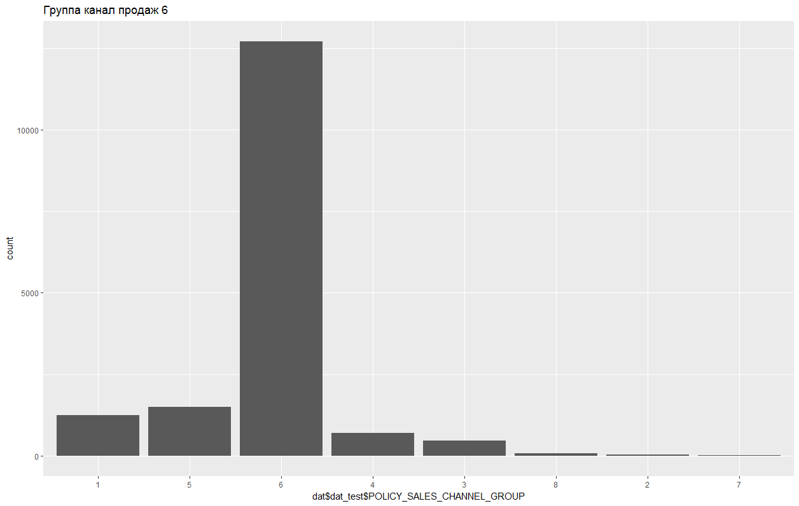
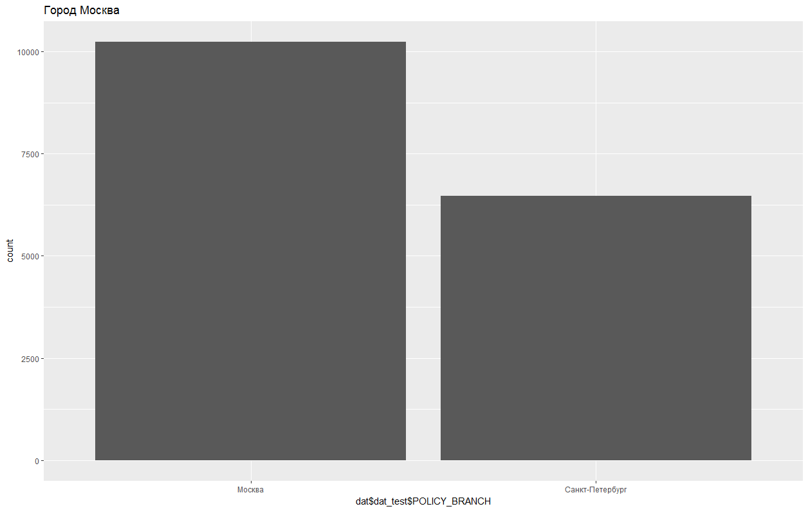
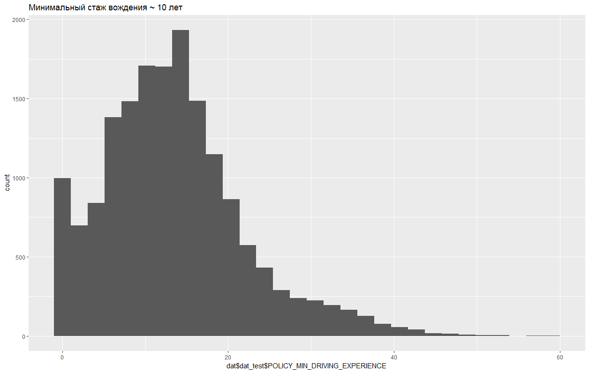
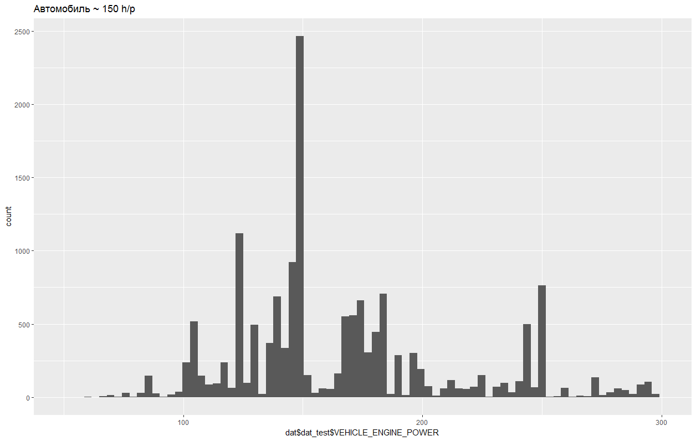
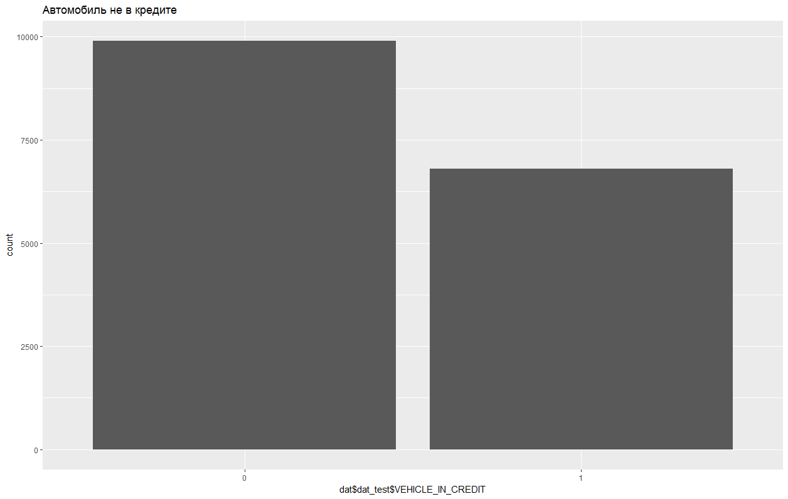
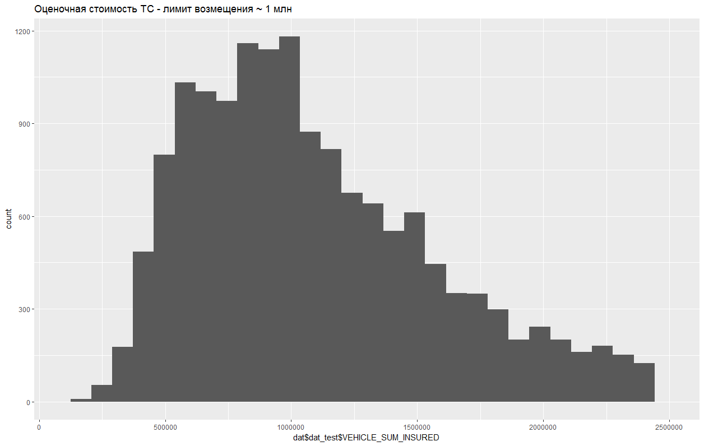
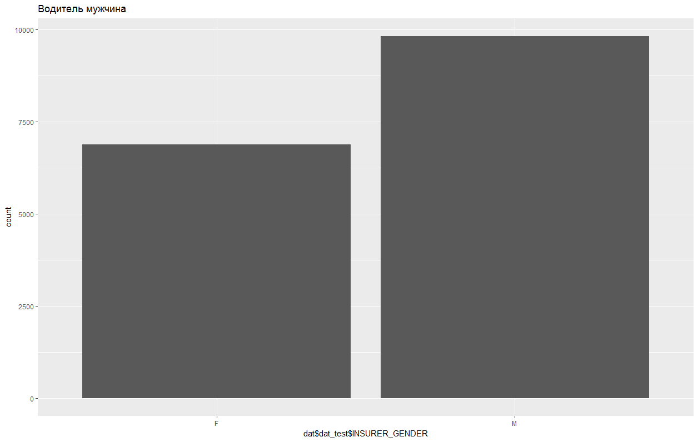
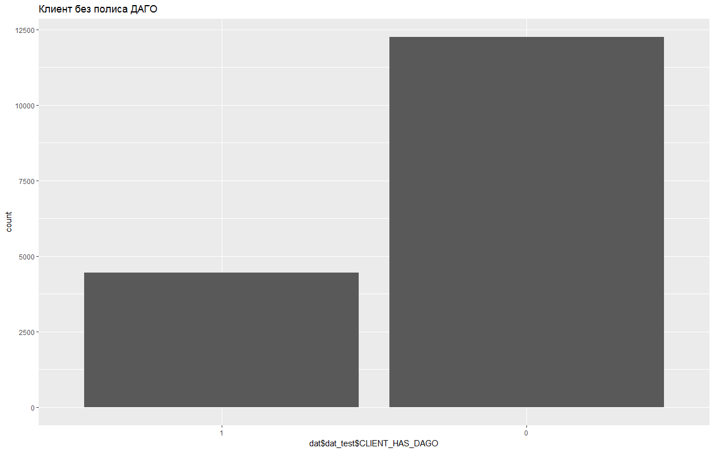
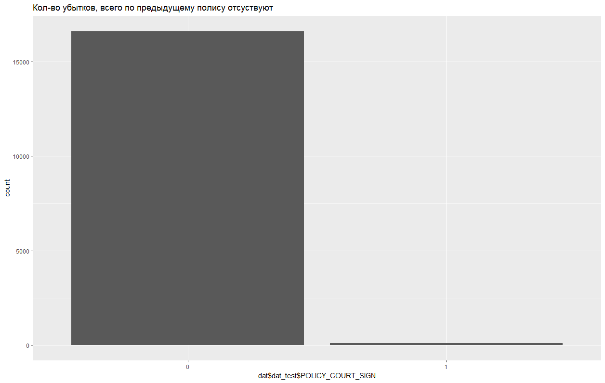

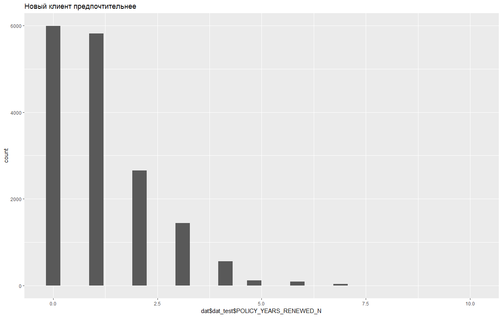
